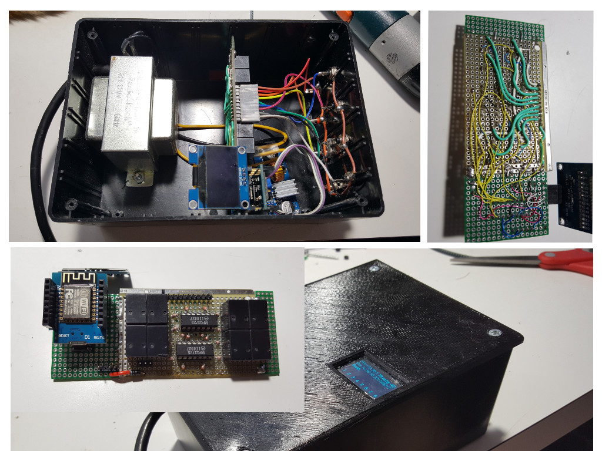
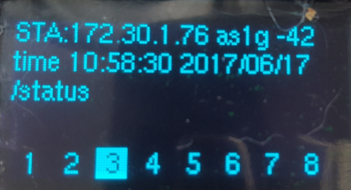
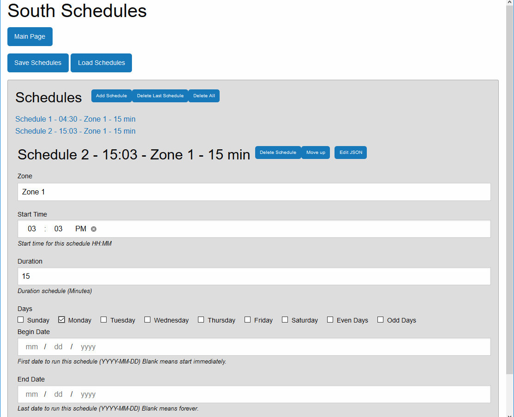
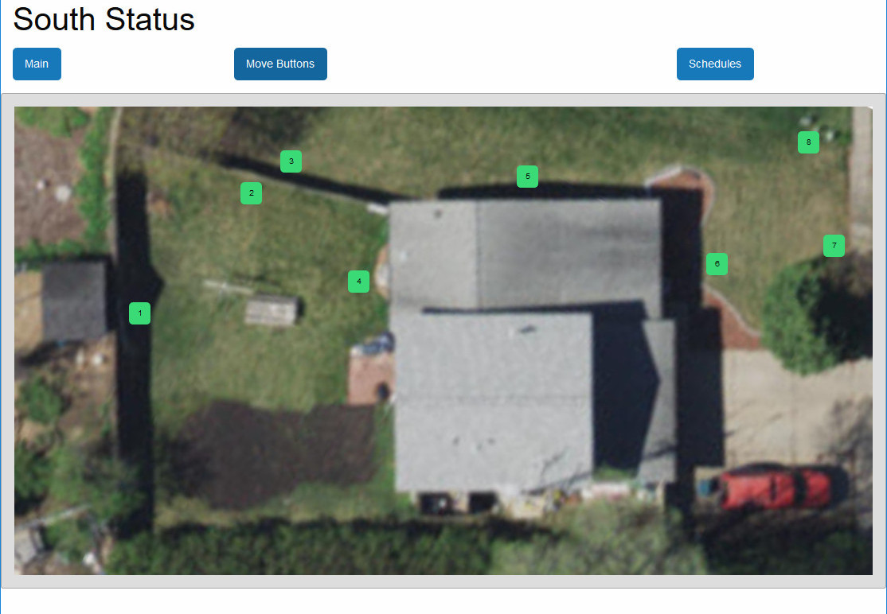
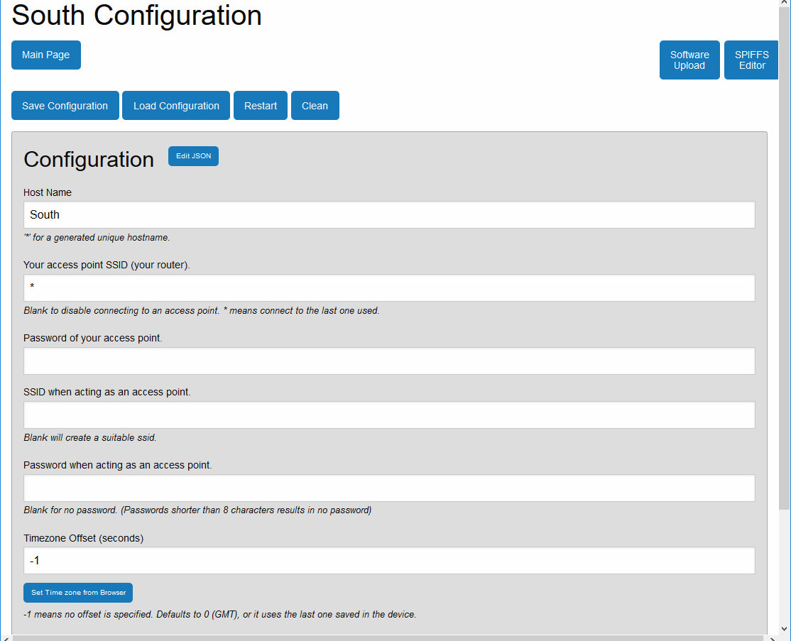

ESPrinkler2
===========
Arduino/ESP8266 based sprinkler Controller.
-------------------------------------------

.. figure:: images/collage.jpg
   :alt: ESPrinkler2 Collage

This is a totally rewritten second version of
https://github.com/n0bel/ESPrinkler Consider that code now totally
obsolete.

This project uses Arduino/ESP8266 to create a web based lawn/garden
sprinkler controller.

Features
--------
-  Web server based (ESP8266WebServer)
-  Responsive UI (desktop/mobile/tablet) written around Jquery,
   Foundation5, and jsoneditor
-  8 Zones (relays)
-  Up to 30 Schedules
-  NTP Time (or set from browser)
-  RTC Option pcf8563 or ds1307
-  OLED Display Option
-  ArduinoOTA update (code and spiffs)
-  HTTP Server Update (code and spiffs)

Requirements
------------
Hardware
~~~~~~~~
-  ESP-12x (nodemcu, hazza, D1 Mini) (probably others)
-  74HC595
-  ST1306 OLED
-  PCF8563 or ds1307 (optional)
-  Relays

Software
~~~~~~~~
-  Arduino-1.8.3
-  ESP8266/Arduino :Additional Boards Manager URL:
   http://arduino.esp8266.com/stable/package\_esp8266com\_index.json
-  Time 1.5.0 https://github.com/PaulStoffregen/Time
-  SimpleTimer https://github.com/jfturcot/SimpleTimer
   (http://playground.arduino.cc/Code/SimpleTimer)
-  NtpClientLib 2.0.5 https://github.com/gmag11/NtpClient
-  ArduinoJson 5.6.7 https://github.com/bblanchon/ArduinoJson
   (https://bblanchon.github.io/ArduinoJson/)
-  U8G2Lib 2.13.5 https://github.com/olikraus/u8g2
-  orbitalair-arduino-rtc-pcf8563
   https://bitbucket.org/orbitalair/arduino\_rtc\_pcf8563/downloads/
   (https://playground.arduino.cc/Main/RTC-PCF8563)

General Instructions
--------------------

Hardware
~~~~~~~~
This project requires DIY assembly and soldering skills.  At this time there
is no pre-made board.  I've made two of these systems so far, and both of them
are done with proto boards and point to point wiring and assembled in a
water resistant project box.

General Hardware Description
^^^^^^^^^^^^^^^^^^^^^^^^^^^^

An ESP8266 with 4MB (32Mb) of flash is required.  The software makes extensive
use of the flash storage for both OTA updates and spiffs.  Generally this is
an ESP-12x, but other models may be used.  In my case I used a WeMos D1 Mini
as the ESP8266 board.  I had some in the junk box and it has the 3.3v
regulator, and the usb to serial interface built on board.  It also includes
a nodemcu type reset and programming circuit.

The 8 relays are controlled through a 74HC595 8 bit shift register.   This is
simply wired to the SPI interface of the ESP8266 (CS (GPIO15), CLK (GPIO14),
MOSI (GPIO13) connected to Latch, Clock and Data In of the 74HC595).

The shift register outputs are then connected via resistors (10k or so) to the
8 NPN transistors acting as relay drivers.  In my particular case I had some
quad transistors in a 14 pin dip package in my junk box.

These transistors then drive 8 mini 5v relays.  The relay contacts connect
24vac to the corresponding output, and therefore energize a sprinkler solenoid.

A 24vac center tapped transformer powers it all.   One leg of the transformer
output is ground for the circuit, the other side is routed to the relays to
control the solenoids.   The center tap is rectified through a single diode
to feed the input of a buck type dc-dc switch mode converter.  The output
of the convert is set to 5v and is routed to the relays and to the D1 Mini.

The ST1306 OLED is an I2C device and therefore connected to SCL (GPIO5)
and SDA (GPIO4) of the ESP8266.

For the optional real time clock (pcf8563 or ds1307), I rigged that up on a
proto board stacked on the D1 Mini using stacking pins.

Software
~~~~~~~~
Don't forget to restart the Arduino IDE after installing the libraries
and boards (See the list previously under Software).

Set your esp settings.. the board, programing method, flash size 4M3M.

This uses the SPIFFS file system. So we need to load that in your
esp-12x first. For quicker loading of web pages, almost all the files on
the spiffs flash are gzip compressed and they have the suffix ".gz".
The uncompressed data version of all the files is the "Master" in the
"data-uncompressed" folder.   The compress-data.cmd file (windows) will
compress the data in preparation for uploading.  If you've not made any
changes to the contents of data-uncompressed, you don't need to do this step.

Upload the contents of the data folder with MkSPIFFS Tool
("ESP8266 Sketch Data Upload" in Tools menu in Arduino IDE)

Then compile and upload the .ino.

Setup
~~~~~
When initially powered on, the internet access point will not be setup.
The ESPrinkler will therefore switch to AP mode. It will be come an
access point in itself.

So connect to ESPrinkler2_XXXXXX with a wifi enabled device (no
password).

Browse to 192.168.4.1

The initial page will let you toggle the relays on/off to test.

But the first thing you'll want to do is click "Set Time from Browser".  Both
the time and the correct time zone are now set up.

Now go to the Configuration page

Set a host name.  This will help allow you to access the device from your
browser (if you can use mDNS).

Set your access point name and password. You have 2 choices here.

-  If you want to connect the device to your network, fill in your access
   point SSID and password.
-  If you want to leave it as a stand alone access point all by itself,
   fill in the second set of SSID and Password, to secure the access point.

Click Save Configuration, then click Restart.

What is it's IP? If your computer supports mDNS (Anything but windows,
but even on windows it'll be there if you have loaded iTunes), you can
access it with the following url: http://<host>.local/, where
<host> is the host you specified in your configuration.  If you don't
have mDNS available, you must find the IP address of the ESPrinkler2
through one of the following methods (or make up your own method)

-  Look at the OLED display (if you're using one)
-  Log into your router and look at the dhcp leases (sometimes called
   dhcp client list) find the entry that shows ESP_xxxxxx
-  Connect a serial ttl dongle to the ESPrinkler2, set the baud rate to
   74880. During startup, you'll see the IP address shown.
-  Get mDNS on your computer: here's some info for windows:
   http://stackoverflow.com/questions/23624525/standard-mdns-service-on-windows
-  ping from a computer that does handle mDNS -- ping <hostname>.local

General usage
~~~~~~~~~~~~~

The Main web page of ESPrinkler2 allows you to test each of the 8 relays. Of
course it also allows navigation to the other pages.  The web pages use a
combination of jQuery, and Foundation5 to create a simple UX that is also
responsive to Desktop, Mobile and Tablet formats.  In addition JsonEditor is
used to simplify entering/editing the settings and schedules.  The frameworks
are all loaded onto the spiffs of the device, so it will work even when no
internet is connected.

.. figure:: images/esprinkler_mainpage.jpg
   :alt: ESPrinkler2 Main Page

The OLED Screen
^^^^^^^^^^^^^^^
The OLED screen gives the current status of the device, as well as its IP
address.

The top line will show the WiFi Status.
-  STA: IP address means connected in Station mode to an access point.
-  AP: IP address means it is acting as an access point.  The second line
   will show the access point name
-  DIS: means it is disconnected.

The bottom line shows that status of each zone (relay).

Schedules
^^^^^^^^^

The schedules page allows adding, specifying and arranging schedules of when
to turn on and off each zone (relay).  Start time, duration, days of week, are
each set for each schedule.  Up to 30 schedules may be setup.

The Image Page
^^^^^^^^^^^^^^

The image page gives you a graphical representation of each sprinkler zone.
This is handy when testing your sprinklers and setting them up.

There is a default image supplied, and by default 8 buttons, representing each
zone appear along the top of the image.  The image could be a sketch or a
satellite image of the are the sprinklers are installed.

The "Move Buttons" button can be activated, and the buttons may be moved
around the image (mouse or touch) to indicate which zone is where on the image.
"Save Buttons" then saves the button locations.

The name of the image file is simply "image.jpg" and it can be placed into the
data-uncompressed and/or data folder before loading the spiffs into the device.
It can also be uploaded using the built in spiffs editor (discussed later in
this document.)

Configuration Page
^^^^^^^^^^^^^^^^^^

The configuration page allows you to set the ESPrinkler2 as needed.

The save and load configuration buttons are self explanatory.  Restart is a
reset of the ESP8266.  The "Clean" button clears all configuration (and
schedules and button settings).

+----------------+-------------------------------------------------------+
| Config Item    | Description                                           |
+================+=======================================================+
| Host Name      | The name you give to the device. No spaces allowed    |
|                | The default access point name, and the mDNS name will |
|                | use this name.  If not specified ESPrinkler2_XXXXXX   |
|                | (XXXXXX) is the chipid of the device.                 |
+----------------+-------------------------------------------------------+
| Your Access    | If you want to connect the device to your WiFi network|
| Point SSID     | enter its SSID here.                                  |
+----------------+-------------------------------------------------------+
| Password of    | The password of your access point.                    |
| your Access    |                                                       |
| Point          |                                                       |
+----------------+-------------------------------------------------------+
| SSID when      | If you want the device to act as a stand alone access |
| acting as an   | point (i.e. no internet, only direct connect)         |
| access point   | specify that SSID here.  If blank, it will default as |
|                | the Host Name (or host name default)                  |
+----------------+-------------------------------------------------------+
| Password when  | The password for securing the access point.           |
| acting as an   |                                                       |
| access point   |                                                       |
+----------------+-------------------------------------------------------+
| Timezone       | The timezone offset in seconds.  How many seconds     |
| Offset in      | ahead (positive) or behind (negative) of UTC          |
| seconds        | There is a button to allow this to be set from the    |
|                | browser. If you use -1, the last offset specified by  |
|                | Set Time from browser on the main page will be used.  |
+----------------+-------------------------------------------------------+
| NTP Time Server| What time server to use for getting NTP time.  Note   |
|                | this only works when the device is connected to an    |
|                | access point that has internet access.                |
+----------------+-------------------------------------------------------+

Software Update
^^^^^^^^^^^^^^^

On the Configuration Page, there is a "Software Upload" button.  This allows
new firmware or a new spiffs binary to be loaded directly from your browser.
Simply choose the binary image to upload, and then click "Upload!".
This process can take some time.  You can check progress on the OLED screen.

.. figure:: images/esprinkler2_update.jpg
   :alt: ESPrinkler2 Update

SPIFFS edit
^^^^^^^^^^^^^^^

On the Configuration Page, there is a "SPIFFS Editor" button.  This allows
you to upload, delete and change the files that the web server uses.

.. figure:: images/esprinkler2_edit.jpg
   :alt: ESPrinkler2 SPIFFS editor
